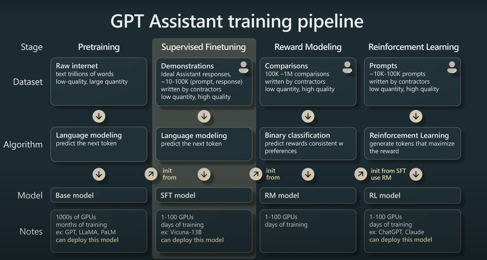
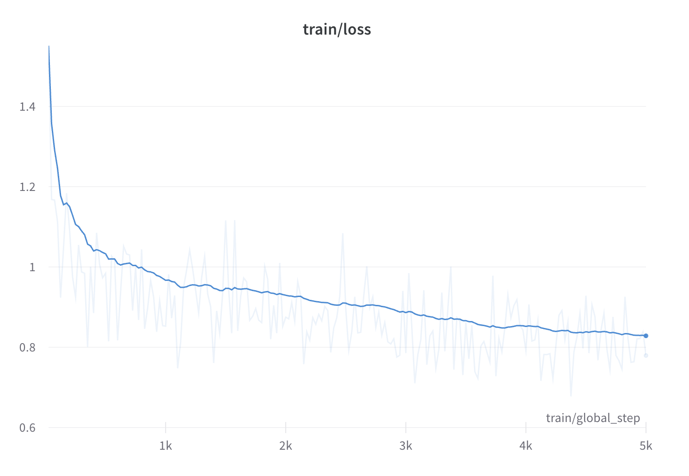
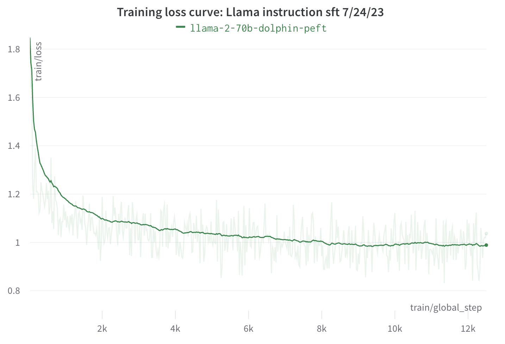

# Supervised finetuning of instruction-following LLMs

 
 
 

This repo contains demos for supervised finetuning (sft) of large language models, like Meta's [llama-2](https://huggingface.co/meta-llama/Llama-2-7b-hf). In particular, we focus on tuning for short-form instruction following capabilities.

## Instruction tuning background

 In recent years, there has been a growing interest in building models that can follow natural language instructions to perform a wide range of tasks. These models, known as "instruction-tuned" language models, have demonstrated the ability to generalize to new tasks.
 
 The below was captured from the "[State of GPTs](https://www.youtube.com/watch?v=bZQun8Y4L2A)" talk by Andrej Karpathy. The key points illustrated for SFT:

* Collect small but high-quality datasets in the form of "prompt" and "ideal responses". 
* Do language modeling on this data, nothing changes algorithmically from pretraining. 
* After training we get an SFT model which can be deployed as assistants (and it works to some extent).

For more background, see any number of excellent papers on the subject, including [Self-Instruct](https://arxiv.org/pdf/2212.10560.pdf) (2023), [Orca](https://arxiv.org/pdf/2306.02707.pdf) (2023), and [InstructGPT](https://arxiv.org/pdf/2203.02155.pdf) (2022). 

## Code assets

* See the `./sft` folder for finetuning scripts and postprocessing notebooks.
* See the `./runs` folder for the raw results from each sft experiment.
* See the `./inf_tests` folder for runtime testing notebooks.

## Base models and datasets

In this repo, we finetune the following base models. Each is open-source and licensed for commercial use.

* [llama-2](https://huggingface.co/meta-llama/Llama-2-70b-hf)
* [falcon](https://huggingface.co/tiiuae/falcon-180B)
* [mpt](https://huggingface.co/mosaicml/mpt-7b)

We test the following datasets. Each is open-source and licensed for commercial use.

* [timdettmers/openassistant-guanaco](https://huggingface.co/datasets/timdettmers/openassistant-guanaco)
* [ehartford/dolphin](https://huggingface.co/datasets/ehartford/dolphin)
* [garage-bAInd/Open-Platypus](https://huggingface.co/datasets/garage-bAInd/Open-Platypus)

## Finetuned models

**NB**: We use state-of-the-art [Language Model Evaluation Harness](https://github.com/EleutherAI/lm-evaluation-harness) to run the benchmark tests below, using the same version as Hugging Face's [Open LLM Leaderboard](https://huggingface.co/spaces/HuggingFaceH4/open_llm_leaderboard).

 

### 1. [`falcon-180b-instruct-peft`](https://huggingface.co/dfurman/falcon-180b-instruct-peft) 

* Dataset(s): 50% ehartford/dolphin & 50% garage-bAInd/Open-Platypus

This instruction model was built via parameter-efficient QLoRA finetuning of [falcon-180b](https://huggingface.co/tiiuae/falcon-180B) on the first 5k rows of [ehartford/dolphin](https://huggingface.co/datasets/ehartford/dolphin) and the first 5k riws of [garage-bAInd/Open-Platypus](https://huggingface.co/datasets/garage-bAInd/Open-Platypus). Finetuning was executed on 4x A6000s (48 GB RTX) for roughly 32 hours on the [Lambda Labs](https://cloud.lambdalabs.com/instances) platform.

### Benchmark metrics

| Metric                | Value |
|-----------------------|-------|
| MMLU (5-shot)         | Coming |
| ARC (25-shot)         | Coming |
| HellaSwag (10-shot)   | Coming |
| TruthfulQA (0-shot)   | Coming |
| Avg.                  | Coming |

### Helpful links

* Model license: [Falcon-180B TII License](https://huggingface.co/spaces/tiiuae/falcon-180b-license/blob/main/LICENSE.txt)
* Basic usage: [here](https://github.com/daniel-furman/sft-demos/blob/main/src/sft/multi_gpus/falcon/postprocessing-falcon-180b-instruct-peft.ipynb)
* Finetuning code: [here](https://github.com/daniel-furman/sft-demos/blob/main/src/sft/multi_gpus/falcon/sft-falcon-180b-instruct-peft.py)
* Runtime stats: [here](https://github.com/daniel-furman/sft-demos#runtime-tests)

### Loss curve

The above loss curve was generated from the run's private wandb.ai log.  

### Example prompts and responses

Example 1: 

**User**:
> You are a helpful assistant. Write me a numbered list of things to do in New York City.\n

**falcon-180b-instruct-peft**:
> 1. Visit the Empire State Building: Take in the breathtaking views of the city from the observation deck on the 86th floor.
> 2. Stroll through Central Park: Enjoy the lush greenery, lakes, and various attractions in this iconic urban park.
> 3. Explore the Metropolitan Museum of Art: Admire the vast collection of art from around the world, spanning thousands of years.
> 4. See a Broadway show: Experience the magic of live theater in one of the world's most famous theater districts.
> 5. Walk across the Brooklyn Bridge: Take in the stunning views of the Manhattan skyline and the East River as you cross this iconic bridge.
> 6. Visit the Statue of Liberty: Take a ferry to Liberty Island and climb to the top of the statue for a unique perspective of the city.
> 7. Visit the 9/11 Memorial and Museum: Pay tribute to the victims of the September 11th attacks and learn about the events that changed the world.
> 8. Visit Times Square: Experience the bright lights and bustling energy of this iconic intersection.
> 9. Visit the High Line: Stroll along this elevated park, built on a former railroad track, and ...

 

Example 2: 

**User**:

> You are a helpful assistant. Write a short email inviting my friends to a dinner party on Friday. Respond succinctly.\n

**falcon-180b-instruct-peft**:

> Subject: Dinner Party Invitation - Friday, 7pm
> 
> Dear friends,
> 
> I would like to invite you to a dinner party at my place this Friday at 7pm. It would be a great opportunity to catch up and enjoy some delicious food together.
> 
> Please let me know if you can make it by Wednesday. I look forward to seeing you all!
> 
> Best,
> [Your Name]
> 
> P.S. Please let me know if you have any dietary restrictions.

 

Example 3: 

**User**:

> You are a helpful assistant. Tell me a recipe for vegan banana bread.\n

**falcon-180b-instruct-peft**:

> Ingredients:
> - 3 ripe bananas
> - 1/3 cup melted coconut oil or vegan butter
> - 1/4 cup non-dairy milk (almond, soy, or oat milk)
> - 1 teaspoon vanilla extract
> - 1/2 cup brown sugar
> - 1 1/2 cups all-purpose flour
> - 1 teaspoon baking powder
> - 1/2 teaspoon baking soda
> - 1/2 teaspoon salt
> - 1/2 teaspoon ground cinnamon (optional)
> - 1/2 cup chopped walnuts or chocolate chips (optional)
> 
> Instructions:
> 
> 1. Preheat your oven to 350°F (175°C). Grease a 9x5-inch loaf pan with vegan butter or coconut oil.
> 2. In a large mixing bowl, mash the ripe bananas with a fork until they are smooth.
> 3. Add the melted coconut oil or vegan butter, non-dairy milk, vanilla extract, and brown sugar to the mashed bananas. Mix well until combined.
> 4. In a separate bowl, whisk together the all-purpose flour, baking powder, baking soda, salt, and ground cinnamon (if using).
> 5. Gradually add the dry ingredients to the wet ingredients, mixing until just combined. Do not overmix.
> 6. If you're using walnuts or chocolate chips, gently fold them into the batter.
> 7. Pour the batter into the prepared loaf pan and smooth the top with a spatula.
> 8. Bake for 45-55 minutes, or until a toothpick inserted into the center of the loaf comes out clean.
> 9. Allow the banana bread to cool in the pan for 10 minutes before transferring it to a wire rack to cool completely.
> 10. Slice and serve warm or at room temperature. Enjoy!
>
> Note: You can also use whole wheat flour or a gluten-free flour blend in place of all-purpose flour. Adjust the baking time accordingly, as whole wheat flour or gluten-free flour may require a longer baking time.
>
> Optional variations:
> - Add 1/2 cup of chopped nuts (walnuts, pecans, or almonds) or chocolate chips to the batter for extra flavor and texture.
  
 

### Runtime tests

| runtime / 50 tokens (sec) | GPU             | attn | torch dtype | VRAM (GB) |
|:-----------------------------:|:----------------------:|:---------------------:|:-------------:|:-----------------------:|
| 27.15                        | 4x A6000s (48 GB RTX)  | torch               | nf4    | 140                    |

 

### 2. [`llama-2-70b-dolphin-peft`](https://huggingface.co/dfurman/llama-2-70b-dolphin-peft)

* Dataset(s): 100% ehartford/dolphin

This instruction model was built via parameter-efficient QLoRA finetuning of [llama-2-70b](https://huggingface.co/meta-llama/Llama-2-70b-hf) on the first 25k rows of [ehartford/dolphin](https://huggingface.co/datasets/ehartford/dolphin) (an open-source implementation of [Microsoft's Orca](https://www.microsoft.com/en-us/research/publication/orca-progressive-learning-from-complex-explanation-traces-of-gpt-4/)). Finetuning was executed on a single H100 (80 GB PCIe) for roughly 17 hours on the [Lambda Labs](https://cloud.lambdalabs.com/instances) platform.

### Benchmark metrics

| Metric                | Value |
|-----------------------|-------|
| MMLU (5-shot)         | 69.18 |
| ARC (25-shot)         | 69.62 |
| HellaSwag (10-shot)   | 86.82 |
| TruthfulQA (0-shot)   | 57.43 |
| Avg.                  | 70.76 |

### Helpful links

* Model license: Llama 2 Community License Agreement
* Basic usage: [notebook](https://huggingface.co/dfurman/llama-2-70b-dolphin-peft/blob/main/assets/basic_inference_llama_2_70b_dolphin.ipynb)
* Finetuning code: [script](https://github.com/daniel-furman/sft-demos/blob/main/src/sft/one_gpu/llama-2/dolphin/sft-llama-2-70b-dolphin-peft.py)

### Loss curve

The above loss curve was generated from the run's private wandb.ai log.  

### Example prompts and responses

Example 1: 

**User**:
> You are a helpful assistant. Write me a numbered list of things to do in New York City.\n

**llama-2-70b-dolphin-peft**:
> 1. Visit the Statue of Liberty: Take a ferry to Liberty Island and see the iconic symbol of freedom and democracy.
> 2. Explore Central Park: Enjoy the lush greenery, take a stroll, or rent a bike to explore the park's many attractions, such as the Central Park Zoo and Strawberry Fields.
> 3. Visit the Empire State Building: Take an elevator to the observation deck for breathtaking views of the city.
> 4. Walk the Brooklyn Bridge: Cross the historic bridge and enjoy the stunning views of the Manhattan skyline.
> 5. Experience Times Square: Take in the bright lights, billboards, and bustling energy of this iconic intersection.
> 6. Visit the Metropolitan Museum of Art: Explore the vast collection of art and artifacts from around the world.
> 7. Take a food tour: Sample the diverse cuisine of New York City, from pizza to bagels to ethnic specialties.
> 8. Attend a Broadway show: Enjoy a world-class performance in the heart of the Theater District.

 

Example 2: 

**User**:

> You are a helpful assistant. Write a short email inviting my friends to a dinner party on Friday. Respond succinctly.\n

**llama-2-70b-dolphin-peft**:

> Subject: Dinner Party Invitation - Friday, 7 PM
> 
> Dear Friends,
> 
> I hope this email finds you well! I'm excited to invite you to a dinner party at my place this Friday, at 7 PM. We'll have a delicious meal, great company, and lots of fun. Please let me know if you can make it, so I can plan accordingly.
> 
> Looking forward to seeing you all!
> 
> Kind regards,
> Your Name

> P.S. Please let me know if you have any dietary restrictions or allergies.

 

Example 3: 

**User**:

> You are a helpful assistant. Tell me a recipe for vegan banana bread.\n

**llama-2-70b-dolphin-peft**:

> Sure! Here's a delicious and easy vegan banana bread recipe:
> 
> Ingredients:
> - 2 cups all-purpose flour
> - 1/2 cup sugar
> - 1/2 cup vegan butter (such as Earth Balance)
> - 1/2 cup vegan milk (such as almond milk)
> - 1/2 cup unsweetened applesauce
> - 1/2 cup mashed ripe bananas (about 2 medium bananas)
> - 1 teaspoon baking soda
> - 1/2 teaspoon salt
> - 1/2 teaspoon ground cinnamon
> - 1/2 teaspoon ground nutmeg
> - 1/2 teaspoon ground cloves
> - 1/2 cup chopped walnuts (optional)
> 
> Instructions:
> 1. Preheat the oven to 350°F (175°C). Grease a 9x5-inch loaf pan with vegan butter or cooking spray.
> 2. In a large bowl, mix together the flour, sugar, vegan butter, vegan milk, applesauce, bananas, baking soda, salt, cinnamon, nutmeg, and cloves. Stir until well combined.
> 3. Fold in the chopped walnuts, if using.
> 4. Pour the batter into the prepared loaf pan.
> 5. Bake for 50-60 minutes, or until a toothpick inserted into the center of the bread comes out clean.
> 6. Let the bread cool in the pan for 10 minutes before transferring it to a wire rack to cool completely.
> 7. Slice and enjoy!
> 
> Note: You can also add chocolate chips, dried fruit, or other mix-ins to the batter for extra flavor and texture. Enjoy your vegan banana bread!

 

### Runtime tests

| runtime / 50 tokens (sec) | GPU             | attn | torch dtype | VRAM (GB) |
|:-----------------------------:|:----------------------:|:---------------------:|:-------------:|:-----------------------:|
| 4.50                        | 1x H100 (80 GB PCIe)  | torch               | nf4    | 39                    | 

 
