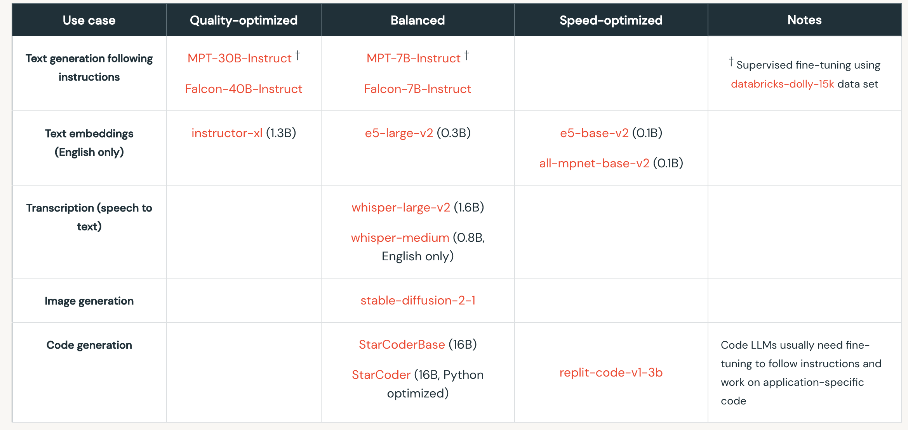

## Supervised finetuning of instruction-following LLMs

This repo includes lightweight demos for supervised finetuning (SFT) of small- to medium-sized LLMs. The scripts here are only compatible to workstations with a single NVIDIA GPU, such as x1 H100 GPU with 80 GB VRAM. 

* Multi-GPU demos for large-sized LLMs aren't included here, see [Multi GPU training with DDP](https://pytorch.org/tutorials/beginner/ddp_series_multigpu.html) for example).

### Code assets

* See the `./sft` folder for finetuning scripts and postprocessing notebooks.
* See the `./runs` folder for the raw results from each sft experiment.
* See the `./inf_tests` folder for experiments measuring the runtime of different sft models.

## Documentation

### SFT is the second step in a typical GPT training pipeline

Below image from "[State of GPTs](https://www.youtube.com/watch?v=bZQun8Y4L2A)" by Andrej Karpathy. 

Key points for SFT:

* Collect small but high-quality datasets in the form of "prompt" and "ideal responses". 
* Do language modeling on this data, nothing changes algorithmically from pretraining. 
* After training we get an SFT model which can be deployed as assistants (and it works to some extent).
* The scripts herein perform full parameter sft (updates each weight in the network)

### Models employed

Below image from "[LLM guidance on open-source models](https://www.databricks.com/product/machine-learning/large-language-models-oss-guidance)" by Databricks. 

* The table below lists current model recommendations for popular LLM use cases. Note that the table only lists open-source models that are for free commercial use. (Last updated: June 12, 2023). 
* In this `sft_demos` repo we will finetune the Falcon-7B and MPT-7B base models on instruction-following datasets to reproduce the "Falcon-7B-Instruct" and "MPT-7B-Instruct" models. 

### Datasets employed

An instruction dataset is derived from a mix of "[mosaicml/dolly_hhrlhf](https://huggingface.co/datasets/mosaicml/dolly_hhrlhf)" and "[timdettmers/openassistant-guanaco](https://huggingface.co/datasets/timdettmers/openassistant-guanaco)" for sft. Each is open-source and licensed for commercial use.

