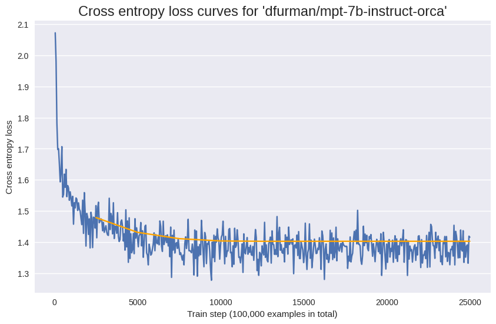

# Supervised finetuning of instruction-following LLMs

 
 
 

This repo includes lightweight demos for supervised finetuning (SFT) of large language models (LLMs), like MosaicML's [MPT-7B](https://huggingface.co/mosaicml/mpt-7b).

## Code assets

* See the `./sft` folder for finetuning scripts and postprocessing notebooks.
* See the `./runs` folder for the raw results from each sft experiment.
* See the `./inf_tests` folder for runtime tests on different models.

## SFT is the second step in a typical GPT training pipeline

Below image from "[State of GPTs](https://www.youtube.com/watch?v=bZQun8Y4L2A)" by Andrej Karpathy. 

Key points for SFT:

* Collect small but high-quality datasets in the form of "prompt" and "ideal responses". 
* Do language modeling on this data, nothing changes algorithmically from pretraining. 
* After training we get an SFT model which can be deployed as assistants (and it works to some extent).
* The scripts herein perform full-parameter sft (updates each weight in the network). Other options include parameter-efficient finetuning, see HuggingFace's [peft](https://github.com/huggingface/peft).

## Base models and datasets employed

In this repo, we finetuned small- to medium-sized LLMs on various instruction-following datasets. 

* [MPT-7B](https://huggingface.co/mosaicml/mpt-7b) (Apache 2.0) 

Several instruction-following datasets are tested herein. Each is open-source and licensed for commercial use.

* [timdettmers/openassistant-guanaco](https://huggingface.co/datasets/timdettmers/openassistant-guanaco) (Apache 2.0)
* [ehartford/dolphin](https://huggingface.co/datasets/ehartford/dolphin) (Apache 2.0)

## Instruction tuned models

### 1. `dfurman/mpt-7b-instruct-orca`

### Model info
The mpt-7b-instruct-orca is finetuned for short-form instruction following.
It was built by training [MPT-7B](https://huggingface.co/mosaicml/mpt-7b) on the first 100k rows of the [ehartford/dolphin](https://huggingface.co/datasets/ehartford/dolphin) dataset (an open-source implementation of [Microsoft's Orca](https://www.microsoft.com/en-us/research/publication/orca-progressive-learning-from-complex-explanation-traces-of-gpt-4/)). 
  * License: _CC-By-SA-3.0_
  * SFT script: see [link](https://github.com/daniel-furman/sft-demos/blob/main/src/sft/one_gpu/mpt-7b/orca/sft-instruction-mpt-7b-orca.py)
  * HF Repo: see [link](https://huggingface.co/dfurman/mpt-7b-instruct-orca)

Run 1: [jul_5_23_3_15_00_sft-instruction-mpt-7b-orca](https://github.com/daniel-furman/sft-demos/tree/main/runs/jul_5_23_3_15_00_sft-instruction-mpt-7b-orca)
* run args: `{'lr': 2e-5, 'num_epochs': 1, 'seed': 43}`
* log summary: `{'train_runtime': 61098.1062, 'train_samples_per_second': 1.637, 'train_steps_per_second': 0.409, 'train_loss': 1.4058428125, 'epoch': 1.0}`

### Example prompts and responses

Example 1: 

**User**:
>You are a helpful assistant. Write me a numbered list of things to do in New York City.\n

**mpt-7b-instruct-orca**:

> 1. Visit the Statue of Liberty: The Statue of Liberty is a symbol of freedom and democracy, and it is a must-see attraction in New York City.
> 2. Take a walk in Central Park: Central Park is a massive green space in the heart of Manhattan, and it is a great place to relax, enjoy nature, and people-watch.
> 3. Visit the Metropolitan Museum of Art: The Met is one of the world's largest and most renowned art museums, housing an extensive collection of art from around the world.
> 4. Take a stroll through Times Square: Times Square is the heart of the city, and it is a must-see for its iconic billboards, bright lights, and bustling energy.
> 5. Visit the Empire State Building: The Empire State Building is a famous skyscraper in Midtown Manhattan, offering panoramic views of the city from its observation deck.
> 6. Explore the Museum of Modern Art (MoMA): MoMA is a renowned art museum in Midtown Manhattan, showcasing modern and contemporary art from around the world.
> 7. Visit the 9/11 Memorial and Museum: The 9/11 Memorial and Museum is a somber but important attraction in Lower Manhattan, commemorating the victims of the September 11th attacks.
> 8. Take a ferry ride to the Statue of Liberty: A ferry ride to the Statue of Liberty is a great way to see the city from the water

Example 2: 

**User**:
>You are a helpful assistant. Daniel is in need of a haircut. His barber works Mondays, Wednesdays, and Fridays. So, Daniel went in for a haircut on Sunday. Does this make logical sense? Let's work this out in a step by step fashion to make sure we have the right answer.\n

**mpt-7b-instruct-orca**:

> Step 1: Identify the days of the week when the barber works.
> 
> The barber works on Mondays, Wednesdays, and Fridays.
> 
> Step 2: Determine the day of the week on which Daniel went for a haircut.
> 
> Daniel went for a haircut on Sunday.
> 
> Step 3: Compare the day of the week on which Daniel went for a haircut to the days when the barber works.
> 
> Sunday is not one of the days when the barber works.
> 
> Step 4: Determine if the statement makes logical sense.
> 
> The statement does not make logical sense because Daniel went for a haircut on a day when the barber does not work.
> 
> Answer: No, the statement does not make logical sense. Daniel should have gone for a haircut on a day when the barber works, such as Monday, Wednesday, or Friday.

Example 3: 

**User**:
>You are a helpful assistant. Write a short email inviting my friends to a dinner party on Friday. Respond succinctly.\n

**mpt-7b-instruct-orca**:

> Subject: Invitation to Dinner Party on Friday
> 
> Dear Friend,
> 
> I hope this email finds you well. I am writing to invite you to a dinner party that I am hosting on Friday. The party will be a casual gathering, and I would love to have you join us.
> 
> The dinner will be held at my home, and the time is from 7:00 pm to 10:00 pm. The address is 123 Main Street, San Francisco, CA 94122.
> 
> The dinner will be a potluck, so please bring a dish to share. I will provide the main course, so you can focus on bringing a side dish, dessert, or appetizer.
> 
> Please RSVP by replying to this email or by calling me at 555-555-5555. I look forward to seeing you on Friday!
> 
> Yours,
> 
> Your Friendly Assistant
